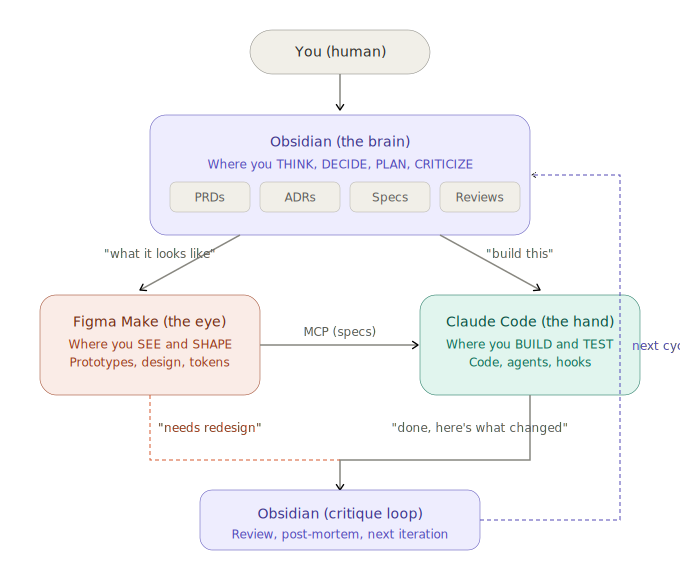

# Claude Proj Blueprint

A modular, level-based project template for teams building software with **Claude Code**, **Obsidian**, and **Figma Make**.

Pick your maturity level. Plug in your specs. Ship.

---

## Why

Every team reinvents project structure from scratch. This blueprint gives you an opinionated skeleton that scales from solo MVP to autonomous multi-agent systems — without locking you into a specific stack.

```
Level 1 → You and Claude Code on a weekend project
Level 4 → Agent teams with self-healing CI and compliance auditors
```

## Maturity Levels

| Level | What | Who it's for | What you get |
|-------|------|-------------|-------------|
| **L1** | ReAct loop | Solo devs, MVPs | `CLAUDE.md` + docs structure + Obsidian vault |
| **L2** | Planner + Executor | Small teams | + Skills (auto-invoked knowledge) + Slash commands |
| **L3** | Multi-agent with critique | Teams in production | + Hooks (automated gates) + Spec review pipeline |
| **L4** | Autonomous system | Mature teams | + Specialized agents + Agent teams + Self-healing |

Each level includes everything from the levels below it.

## Quick Start

```bash
# Clone
git clone https://github.com/rtazima/claude-proj-blueprint.git my-project
cd my-project

# Remove the template's git history and start fresh
rm -rf .git && git init

# Bootstrap at your level
chmod +x scripts/bootstrap.sh
./scripts/bootstrap.sh --level 2

# Fill in your project specifics
grep -r '\[SPEC\]' CLAUDE.md docs/ .claude/ | head -20

# Open docs/ as an Obsidian vault (optional but recommended)
# In Obsidian: Open folder as vault → select docs/

# Start working
claude
```

## Project Structure

```
your-project/
├── CLAUDE.md                    ← L1+  Hub — Claude reads this first
├── .claude/
│   ├── settings.json            ← L1+  Permissions & safety
│   ├── skills/                  ← L2+  Auto-invoked knowledge packs
│   │   ├── code-review/
│   │   ├── testing/
│   │   ├── implement-prd/
│   │   ├── adr/
│   │   ├── memory/              ←      L4 long-term memory retrieval
│   │   └── _template-skill/     ←      Create your own
│   ├── commands/                ← L2+  Slash commands
│   │   ├── implement.md         ←      /implement <prd-path>
│   │   ├── deploy.md            ←      /deploy
│   │   └── spec-review.md       ←      /spec-review <path>
│   ├── hooks.json               ← L3+  Automated gates
│   └── agents/                  ← L4+  Specialized sub-agents
│       ├── compliance-auditor.md
│       ├── security-auditor.md
│       └── quality-guardian.md
├── docs/                        ← L1+  Obsidian vault
│   ├── product/                 ←      PRDs, vision, roadmap
│   ├── architecture/            ←      ADRs (decision records)
│   ├── specs/                   ←      Modular spec modules
│   ├── runbooks/                ←      Deploy, debug, post-mortems
│   ├── workflow.md              ←      Orchestration: who does what
│   └── assets/                  ←      Diagrams and images
├── src/                         ←      Your code
├── memory/                      ← L4+  Long-term vector memory
│   ├── index.py                 ←      Index project into vector DB
│   ├── query.py                 ←      Semantic search CLI
│   ├── config.yaml              ←      Configuration
│   └── requirements.txt         ←      pip install -r memory/requirements.txt
└── scripts/
    ├── bootstrap.sh             ←      Level-based setup
    ├── lint-check.sh            ←      L3+ post-write hook
    ├── security-check.sh        ←      L3+ pre-bash hook
    └── post-commit-index.sh     ←      L4 auto-index on commit
```

## Spec Modules

Specs are **plug-and-play** knowledge modules in `docs/specs/`. Enable only what your project needs.

| Module | What it covers | When to enable |
|--------|---------------|----------------|
| `compliance/` | Laws, regulations, ISOs | Regulated data, certifications |
| `security/` | OWASP, access control, crypto | Every production project |
| `observability/` | Logs, metrics, traces, alerts | Every production project |
| `scalability/` | Caching, queues, performance | When scale matters |
| `versioning/` | API versions, migrations, semver | Public APIs, multiple clients |
| `accessibility/` | WCAG, a11y | User-facing products |
| `i18n/` | Multi-language, localization | International products |
| `testing-strategy/` | Test pyramid, QA process | Teams with 3+ devs |
| `devops/` | CI/CD, IaC, environments | Every production project |
| `data-architecture/` | Modeling, pipelines, analytics | Data-intensive products |
| `ai-ml/` | Models, prompts, evals, guardrails | AI/ML products |
| `long-term-memory/` | Vector DB, semantic search | L4 autonomous systems |

### Adding a custom module

```bash
mkdir docs/specs/my-module
# Use any existing module as reference
# Optionally create .claude/skills/my-module/SKILL.md for auto-invocation
```

## The `[SPEC]` Convention

Every `[SPEC]` marker is an extension point. The blueprint tells you **where** things go; you fill in **what** goes there.

```markdown
## Tech Stack
[SPEC] List the actual project stack:
- Backend: [linguagem + framework]
```

Becomes:

```markdown
## Tech Stack
- Backend: Python + FastAPI
- Frontend: React + TypeScript
- Database: PostgreSQL
```

## How the 4 Layers Work

**L1 — CLAUDE.md** — Claude reads this automatically at every session. Your stack, architecture, conventions, gotchas. Keep it under 200 lines.

**L2 — Skills** — Markdown files that Claude loads based on natural language triggers. Say "write tests" and the testing skill activates automatically.

**L3 — Hooks** — Scripts that run before/after Claude uses tools. Lint on every file write. Security check before every bash command. Exit 0 = allow, exit 2 = block.

**L4 — Agents** — Sub-agents with their own context. Run individually or as a coordinated team with the author-critic loop.

**L4 — Memory** — Vector database indexes `docs/` and `src/` for semantic search. Ask "how did we handle rate limiting?" and get the relevant ADR, code, and PRD. Supports Chroma (local, default) or pgvector (shared, team-wide).

```bash
pip install -r memory/requirements.txt
python memory/index.py              # Index everything
python memory/query.py "auth"       # Semantic search
python memory/query.py --stats      # What's indexed
```

## Who Does What

Obsidian is the brain, Figma is the eye, Claude Code is the hand.



| Question | Answer |
|----------|--------|
| Where do I start? | **Obsidian** — write what you want |
| Who do I talk to? | **Claude Code** — it executes, but reads from Obsidian |
| Where do I design? | **Figma Make** — prototypes and design system |
| Where do I criticize? | **Obsidian** — reviews, post-mortems, next cycle |
| What connects everything? | **Git** — same repo, everything versioned |

See [docs/workflow.md](docs/workflow.md) for the full orchestration guide.

## Daily Workflow

```bash
cd your-project && claude

# L2+
# Shift+Tab+Tab → Plan Mode
# Describe feature intent
# Shift+Tab → Auto Accept
# /compact to compress context
# Commit frequently, new session per feature

# L3+
# /spec-review src/ → run compliance + security + quality audit

# L4+
# /memory search "how did we handle rate limiting"
# "Create an agent team to implement auth with OAuth2"
```

## Integrations

**Obsidian** — Open `docs/` as a vault. PRDs, ADRs, specs are interconnected with `[[wiki-links]]`.

**Figma** — Add Figma links to `CLAUDE.md`. Use the Figma MCP server for design-to-code.

**GitHub** — Issue templates and CI workflow included.

## Contributing

See [CONTRIBUTING.md](CONTRIBUTING.md).

## License

[MIT](LICENSE)

## Author

Created by [@rtazima](https://github.com/rtazima).

---

> *"Opinionated on structure, flexible on content."*
